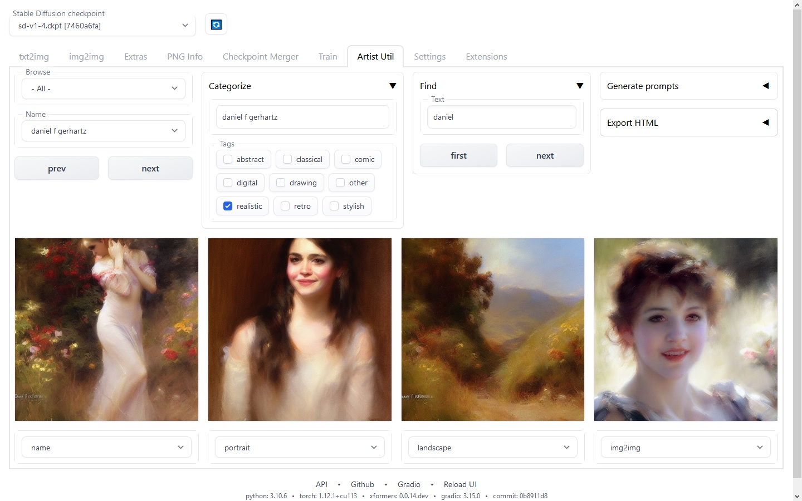
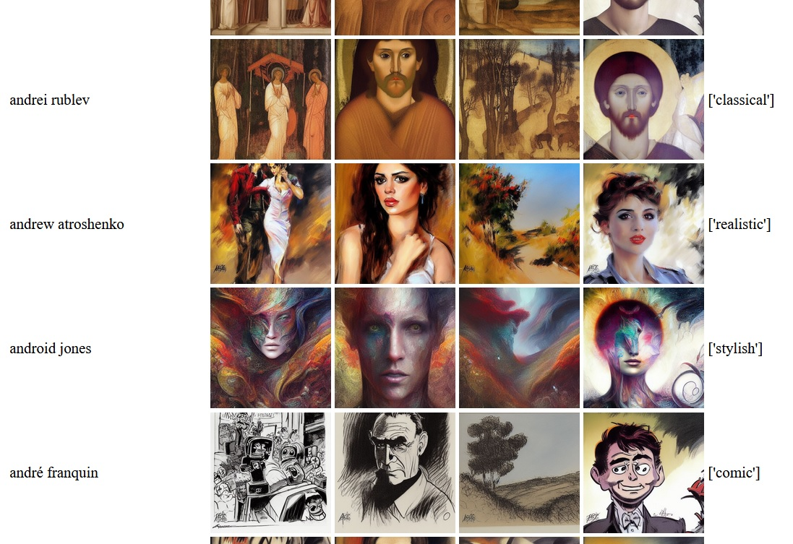

# Artist-Util extension version 1.0 - 2023.01.23

for 

This extension helps you:
* Browse and categorize artist names, while displaying images from different folders
* Generate prompts for use with 'prompts from file or textbox' script
* Export an HTML file containing all the names and images

# Installation

Download  and extract into extensions folder.

[also to see example images you need to extract .zip files in images folder]

# Customization

you can:
* edit artist names in /data/names.txt
* edit wildcard templates in /data/templates.txt
* add category tags by creating empty .txt files in /data/tags/
* add new folders containing bulk generated images, under /images/ (only 1 file per artist name)
* add images in /data/assorted/ folder (set SHOW_ASSORTED = True in script)
* edit some other options in the script, such as HTML export options

